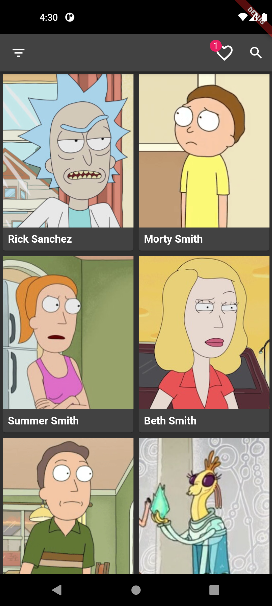
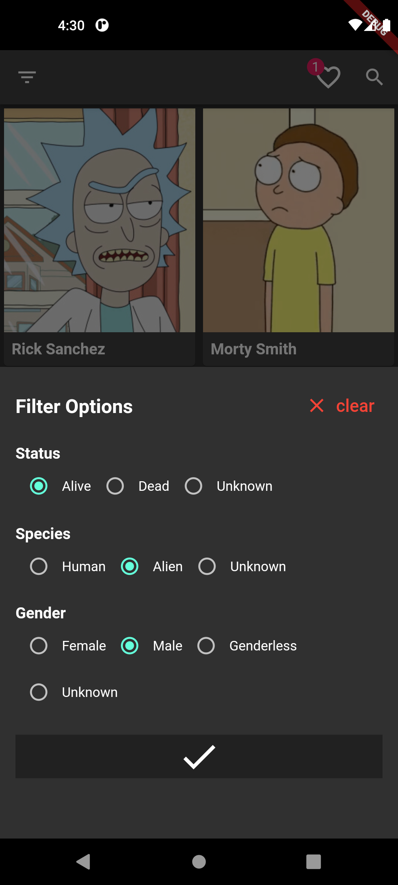
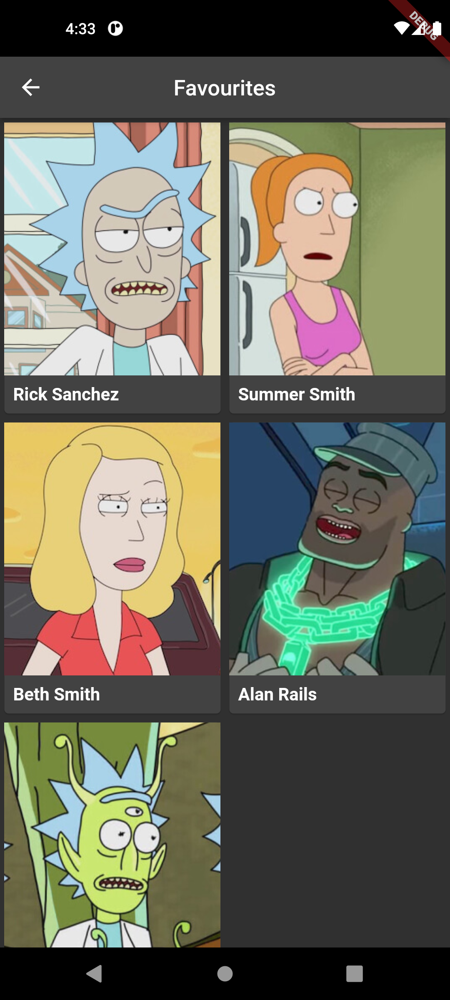
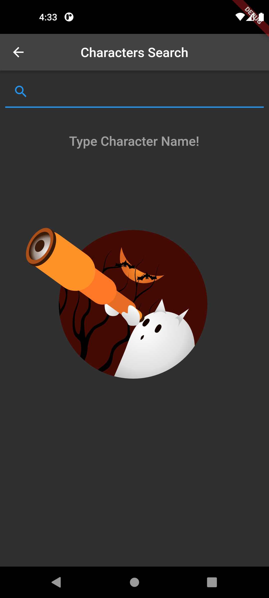
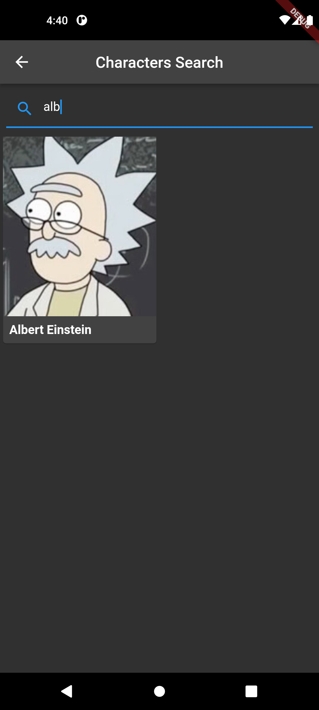
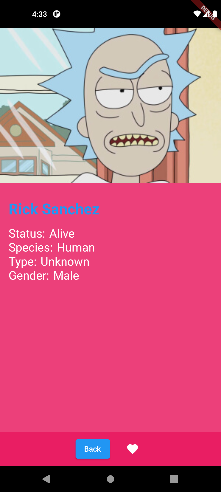

Rick and Morty

A Flutter app showcasing my skills as a developer, specifically my ability to use the BLoC pattern, hydrated BLoC, and API requests. With this app, users can scroll through all the characters from the Rick and Morty show. All data is fetched using the Rick and Morty API. Users can also filter characters by conditions and add characters to their favorites.

Some of the main features of Rick And Morty App includes:
* Clean architecture for efficient code organization
* Fetching Data from Api
* Animations
* Streamlined state management with The Bloc Pattern
* Persisting the data with Hydrated BLoC

  
  
  
  
  
    

